# cs506-final-project repo
Midterm repo presentation:https://youtu.be/2QugIp1c2kw
Final presentation:https://youtu.be/1VRIfMdfIw4

## Goal Predictor
The tool for predicting integer, interval goals and win/draw/loss in a match.

## Summary
Goal Predictor is a tool for predicting integer goals, interval goals (less than 2.5 goals and more than 2.5 goals) and win/draw/loss. It makes predictions by inputting match data. Currently, the Random Forest model is used to predict integer goals, and the Xgboost model is used to predict interval goals and win/draw/loss.

## Run the code
1. Make sure the required toolkit(pip and make) and python3 are installed on your computer.
2. Git clone cs506-final-project.
3. In the cs506-final-project folder of the terminal, enter: make. (Automatically download the environment to decompress the zip and run the code.)
You can also choose to run in segments, but you must first make connect and make clean_data. （After installing the environment and unzipping）

# Data
## Dataset
We are currently using a public database from Kaggle: https://www.kaggle.com/datasets/sashchernuh/european-football.
We will try to merge it with other databases to get more features (such as weather, lineup ratings, etc.) to strengthen the correlation between the input data and the number of goals scored.

## Data preprocessing and visualization
### Select features
We read all the odds related features from the database：

- AvgH = Market average home win odds
- AvgD = Market average draw win odds
- AvgA = Market average away win odds
- Avg>2.5 = Market average over 2.5 goals
- Avg<2.5 = Market average under 2.5 goals
- AvgAHH = Market average Asian handicap home team odds
- AvgAHA = Market average Asian handicap away team odds

And some features that are strongly correlated with the number of goals：
- HS = Home Team Shots
- AS = Away Team Shots
- HST = Home Team Shots on Target
- AST = Away Team Shots on Target

We use connect.py to find the data with the above eleven features from the data set. Convenient for subsequent use.

Also the number of goals scored：
- FTHG  = Full Time Home Team Goals
- FTAG  = Full Time Away Team Goals
- Total_goals = FTHG + FTAG

### data_clean

The histogram can well show the distribution of total goals:

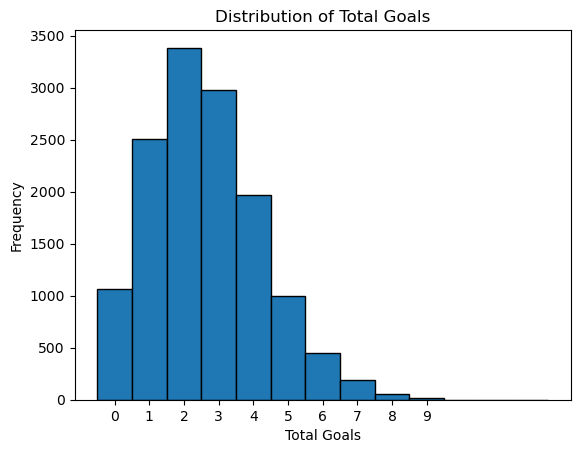

It can be seen that most of the goals are between 0 and 6, and it is very rare to have more than 6 goals. Therefore, in the subsequent random forest prediction of integer goals, we set 6 goals as the upper limit, and the accuracy of 7, 8, and 9 goals is almost 0.

We also made a scatter plot for each feature and the total number of goals. Scatter plots can visually show the relationship between variables and help us find outliers to better clean the data:

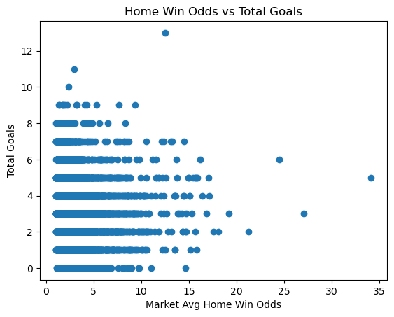

For example, in this scatter plot, we can see that there are several differences in total goals and average home win odds. Therefore, we choose to filter out data with more than 9 goals and average home win odds greater than 20 to reduce the impact of outliers on the overall prediction accuracy and stability of the model.

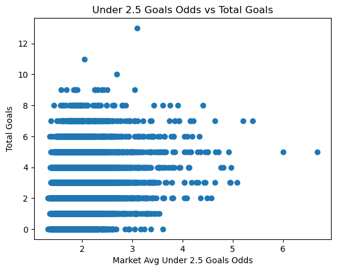

Similarly, in this scatter plot of Avg < 2.5 vs total_goals, we choose to filter out data with a total goal count greater than 9 and an average under 2.5 goals less than 5.

We created clean_data.py to clean up some of the above data.

We used heat_map.py to create a heat map which show the correlation between different features and the total number of goals:

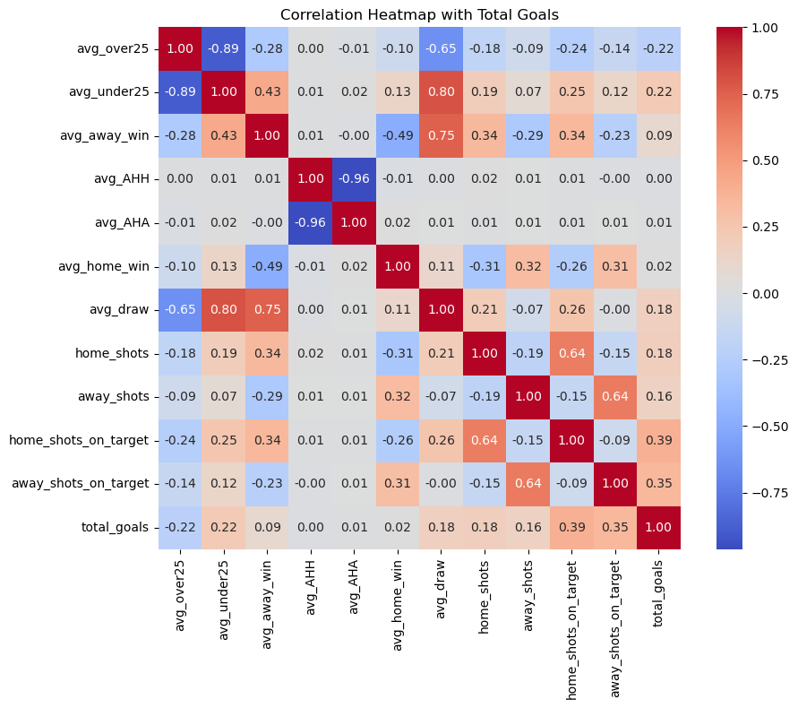

From the heat map, we can observe that shots on target have a strong positive correlation with the total number of goals. In addition, shots, odds of over/under 2.5 goals, away win and draw odds also have a certain correlation with the total number of goals. From the heat map, we can observe that shots on target have a strong positive correlation with the total number of goals. In addition, shots, odds of over/under, away wins and draws also have a certain correlation with the total number of goals. The correlation between features and total goals is crucial for the prediction model. The addition of strongly correlated features is a huge improvement for the model. This is why we added the two features of shots on target and shots. Before adding these two features, the R^2 value of the poisson regression model was only a few percent, but after adding these two features, the R^2 value increased to about 0.25. The accuracy of the predictions of the other two models also increased to varying degrees. Therefore, if we want to improve the prediction ability of the model, it is essential to add strongly correlated features in the future.

## Data modeling and results.

The data in the database that has the eleven features we need are actually distributed in 2019-2021, so we use the data from 2019-2020 as the training set of the model and the data from 2021 as the test set of the model.

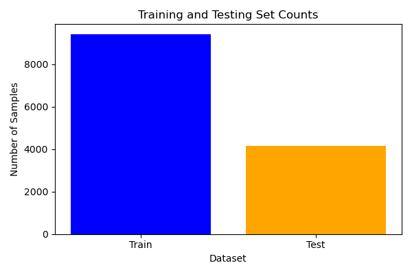

We currently use three different models：

### 1. Ramdom_forest_model
Used Ramdom_forest to predict the number of goals scored as an integer.

In Ramdom_forest_model.py, “predicting the exact number of goals” is to discretize the total number of goals in each game into 10 categories of 0–9, and then use random forest to do multi-classification prediction.

We used the 11 features we sorted out, used the data from 2019-2020 as the training set, the data from 2021 as the test set, and built 200 decision trees. During training, each tree will learn "how to divide the samples by total_goals_class" on the samples (Bootstrapped) and features (random subsets). For each row X_test[i] in the test set, the random forest will send it to each tree. Each tree will traverse downward from the root node according to if feature_j ≤ threshold then go left else go right, and give a "category prediction" (0-9) when it reaches the leaf node. Finally, the predictions of the 200 trees are "voted" and the category with the most votes is the predicted number of goals for the game.

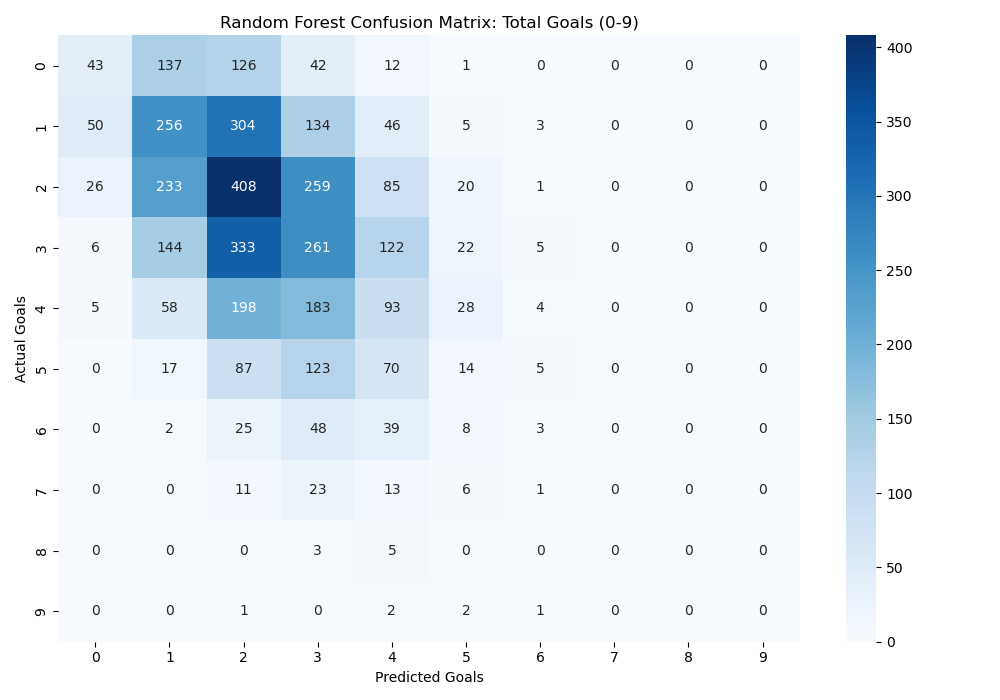

From the confusion matrix, we can see that the prediction of the exact number of goals is not very good. Especially after the number of goals is greater than 7, no prediction was successful. This is because the proportion of matches with more than or equal to 7 goals in the database (training set) is extremely small, and the model has not been fully trained in this case, so it is naturally impossible to predict. On the contrary, the prediction of 1, 2, and 3 goals is much better, because these three situations account for the largest proportion in the database (training set) and have been fully trained. The situation where these three goals appear at the same time is also the most common.

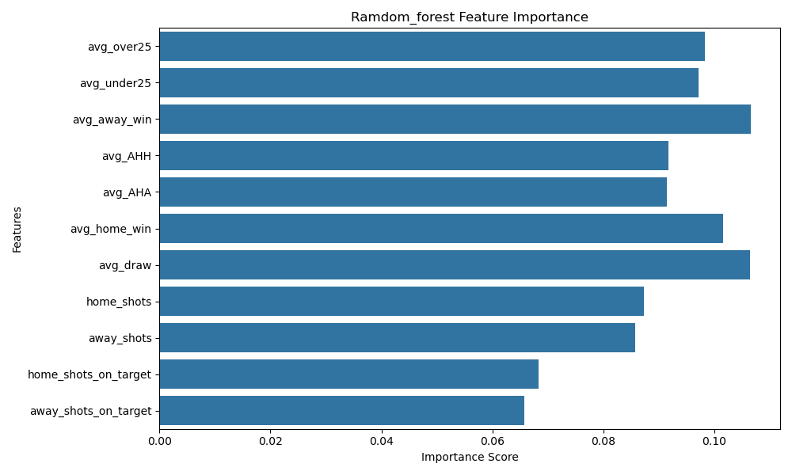

In the case of predicting accurate goals, the feature related to odds is the "probability" indicator calculated from history and handicaps, which itself highly summarizes the home and away teams' tendency to score goals. When distinguishing between subcategories such as "0 goals, 1 goal, 2 goals...", this type of prior probability is often the most informative, so it is frequently selected as a split dimension in the forest. Although shots on the field can also reflect the possibility of scoring, it fluctuates more and has more noise in each game than the long-term accumulated "trend" of odds, so its importance ranks in the middle. Finally, even if shots on target are directly related to goals, they are not as stable as those comprehensive probability indicators for distinguishing such fine categories as "3 goals, 4 goals, 5 goals...", so they are rarely used in the top and middle-level splits of the tree, and the bars are the shortest.

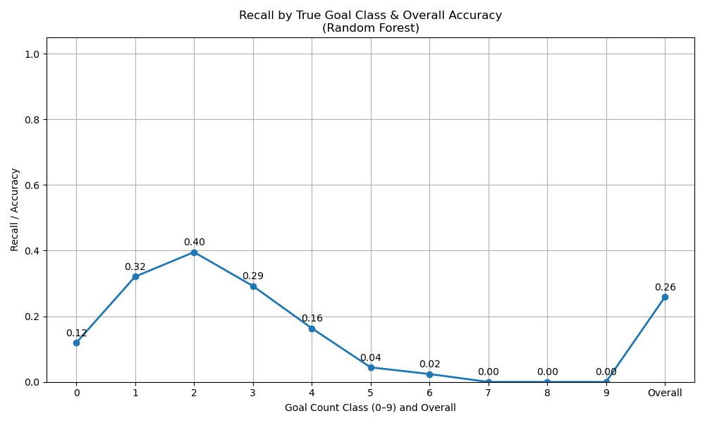

The final accuracy result is consistent with the confusion matrix. The model has the highest accuracy in predicting 1, 2, and 3 goals, and it is almost impossible to predict games with more than 6 goals. In fact, accurately predicting the total number of goals in a game is difficult in itself, and the overall accuracy of 0.26 is also in line with our expectations.

### 2.Xgboost_model

Used Xgboost to predit interval goals (less than 2.5 goals and more than 2.5 goals).

In Xgboost.model.py, use XGBoost to do a binary classification task - predict whether the total number of goals in a game is greater than 2.5 goals (goal_group 0 means ≤2.5 goals, 1 means >2.5 goals)

We used the same features and training and test sets as the previous model. Unlike random forests that train multiple trees at once, XGBoost iteratively adds trees one by one, and each new tree learns in the direction of minimizing the gradient of the prediction errors of all previous trees until n_estimators is reached. For each row X_test[i] in the test set, XGBoost will throw it into all the iteratively trained trees and accumulate the scores output by these trees. Finally, the accumulated results are converted into the predicted probabilities of each category through a softmax function, and the category corresponding to the maximum value is taken as the predict output (0 or 1). predict_proba(X_test) can get the specific probabilities [P(≤2.5), P(>2.5)].

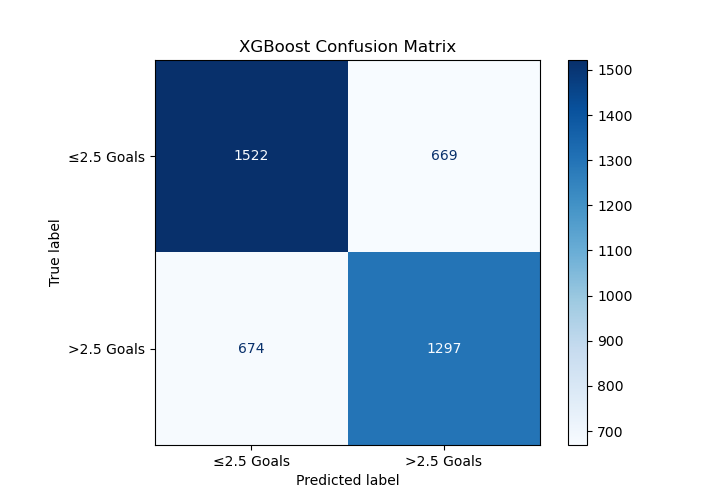

According to the confusion matrix, we can see that the prediction effect of this model is not bad. Whether it is greater than 2.5 goals or less than 2.5 goals, about 2/3 of the predictions are correct.

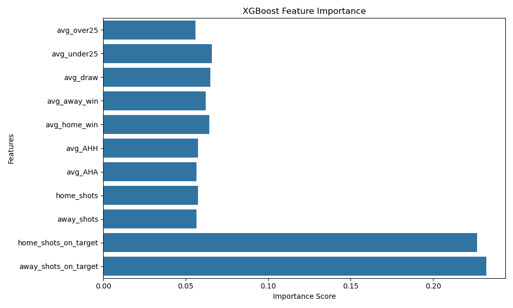

Here, away_shots_on_target and home_shots_on_target have the longest bars, indicating that when judging whether a game will have more than 2.5 goals, "away team shots on target" and "home team shots on target" contribute the most to the split decision - the model believes that they are most helpful in distinguishing over/under goals.

On the contrary, the feature bars of odds or total shots are relatively short, indicating that although they are also used, they are relatively less helpful to the final prediction of the model.

Shots on target is an indicator that directly reflects the efficiency of the attack: more shots on target means more goals. XGBoost found during the training process that it can "split" samples more effectively, thereby separating over/under goals, so it is given high importance.

Although odds information (avg_over25, avg_under25, etc.) is a comprehensive expectation of history and the market, it is not as direct as the real "scene data" in terms of sample level distinction, so the relative weight is lower.

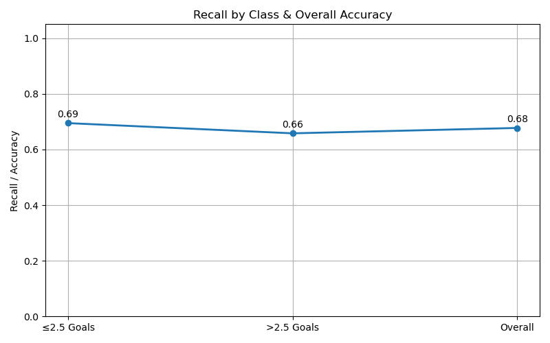

The model has an accuracy rate of 68% in predicting over/under 2.5 goals, which is relatively valuable and can be considered an effective learning outcome.

### 3. XB_model

Used Xgboost to predict the win, loss or draw of a match.

In XB_model.py, XGBoost is used to make three classes classification predictions for the results of a single game, with the categories being "Home Win", "Draw", and "Away Win". 

We used the same features and training and test sets as the previous model. The difference between XB_model and Xgboost_model is that the former uses three classes classification while the latter uses binary classification.

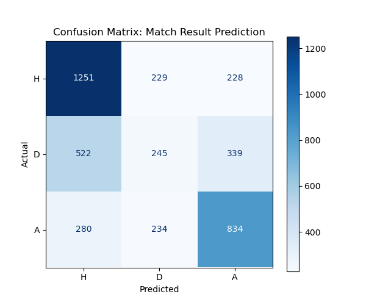

From the confusion matrix, we can see that the prediction of home win is the most accurate. In the data, home win is usually the most common result (home team has obvious advantages in many leagues), away win is second, and draw is the most difficult to predict. Draws often occur when the strength of the two teams is very close and the game is stalemate. The model relies more on the features of "handicap win, draw and loss odds" + "shot data", and is not sensitive enough to extreme draws (draws). At the same time, the proportion of draws is much smaller than that of wins and losses, which also leads to this.

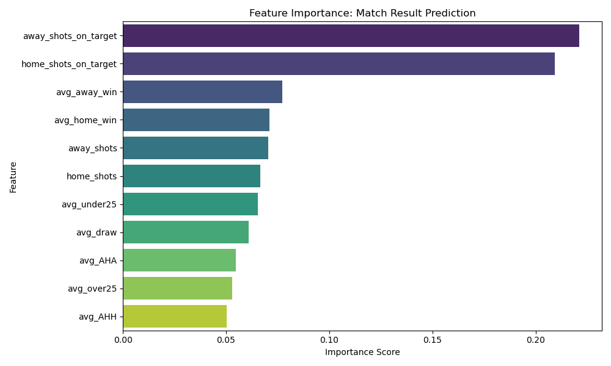

The bar for shots on target is the longest, which means there are more shots on target, and the model is more inclined to judge it as a win (or at least a draw), followed by the odds of home win and away win or draw. 

The more shots on target, the greater the pressure on the opponent's goalkeeping and the more chances to score. XGBoost frequently uses the "shot on target" threshold as the optimal cut point when splitting the tree, thereby accumulating the most "gain".

The avg_home_win / avg_away_win of the handicap is essentially a summary of the probability of different results based on historical big data. Although it contains a lot of information, it is a "global" prior, not as "locally" accurate as the real-time shots on target of the same game.

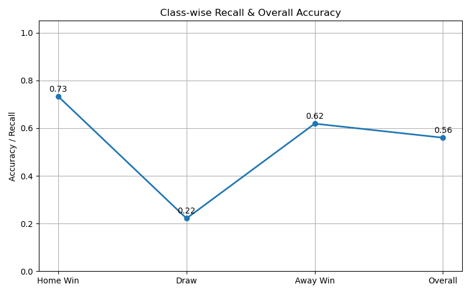

In all the matches where the home team won, 73% were correctly predicted as home wins by the model, indicating that the model had the highest discrimination for home team wins. 62% of the samples where the away team won were correctly identified, which was the second best performance, better than draws but worse than home wins. Only 22% of the samples where the draws were actually drawn were correctly identified, and most of the draws were misclassified as home wins or away wins, making draws the most difficult to predict. Across all samples, the model predicted 56% of the match results correctly on average. Due to the limitations of the dataset itself, it is difficult for us to improve the accuracy of predicting draws, but the overall accuracy of 56% still met our expectations.

## Summarize
I think we achieved our goal, with all three models being more accurate than random guessing.

- Ramdom_forest_model: 0.26 > 0.1
- Xgboost_model: 0.68 > 0.5
- XB_model: 0.56 > 0.33

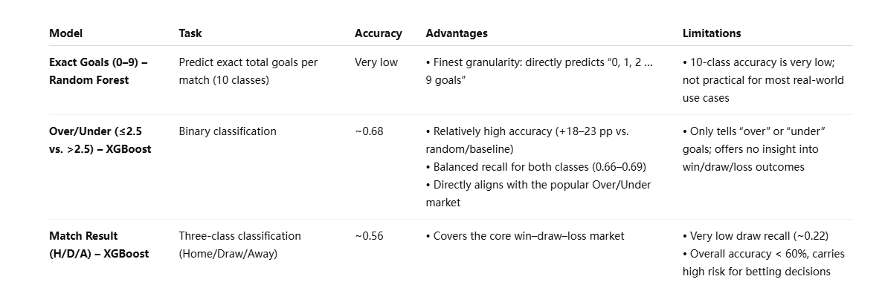

Compared with the other two models, Xgboost_model has the most practical value. (To predit over/under.)

## Shortcomings and areas for improvement

We originally planned to add more features to the dataset after the midterm, such as weather, team ratings, etc. However, considering that the database has about 200,000 records (which means we need 200,000 weather data related to these 200,000 games), and we only have two people (and the technical ability is not enough), we finally chose to give up adding features and try other new models (XB_model). If there is enough time or technical ability in the future, perhaps adding more features can greatly improve the performance of these models.

## How to use the current model to make predictions
Take Xgboost_model as an example(predit over/under)：

1.Make sure you have a sample with 11 features.

2.Open Xgboost_model.py and call the model to make predictions

ie:prediction = model.predict(new_sample)

print(f"Prediction category: {prediction[0]}")// 0 means ≤2.5, 1 means >2.5

